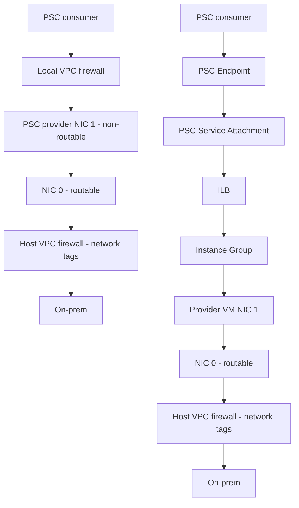

# GCP PSC Flow With AKS Consumer

```mermaid
flowchart TB
    a1["PSC consumer"] --> a2["Local VPC firewall"]
    a2 --> a3["PSC provider NIC 1 - non-routable"]
    a3 --> a4["NIC 0 - routable"]
    a4 --> a5["Host VPC firewall - network tags"]
    a5 --> a6["On-prem"]

    b1["PSC consumer"] --> b2["PSC Endpoint"]
    b2 --> b3["PSC Service Attachment"]
    b3 --> b4["ILB"]
    b4 --> b5["Instance Group"]
    b5 --> b6["Provider VM NIC 1"]
    b6 --> b7["NIC 0 - routable"]
    b7 --> b8["Host VPC firewall - network tags"]
    b8 --> b9["On-prem"]
```
