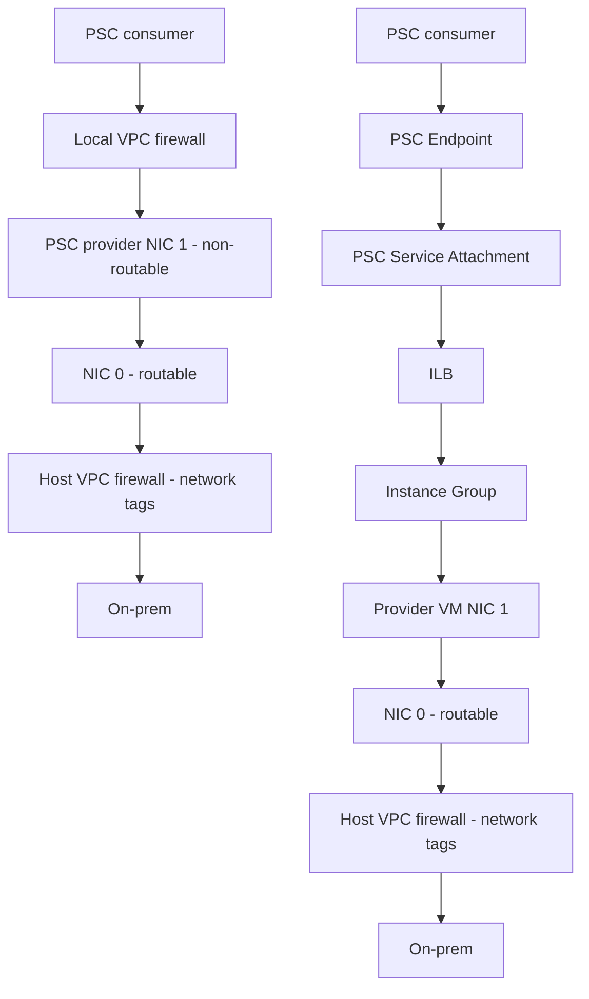

# GCP PSC Flow With AKS Consumer

## Explanation (GCP terms for AKS communication)

### Flow A - Direct provider NIC path (top)
- The AKS workload acts as the PSC consumer and reaches the provider VPC over private connectivity.
- Traffic passes the local VPC firewall and lands on the provider VM's non-routable NIC (NIC 1).
- The VM forwards traffic to the routable NIC (NIC 0), then through host VPC firewall rules (network tags) to on-prem.

### Flow B - PSC endpoint to ILB path (bottom)
- The AKS workload connects to a PSC endpoint in the consumer VPC.
- The PSC endpoint maps to a PSC service attachment in the provider VPC.
- The service attachment fronts a GCP Internal HTTP(S) Load Balancer (ILB).
- Host-based routing happens at the ILB using a URL map (Host header/SNI rules) to choose the backend service.
- The selected backend (instance group / NEG) forwards via provider VM NIC 1 → NIC 0 (routable) → VPC firewall → on-prem.

### Host-based routing summary
- PSC only provides private reachability; it does not do host routing.
- The Internal HTTP(S) Load Balancer performs host-based routing via URL map rules.
- AKS just sends HTTPS with the correct Host header; the ILB picks the backend.
