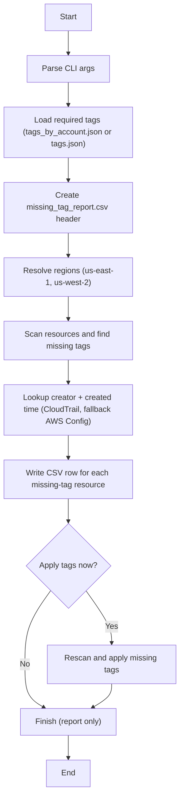

# Tagging Script Flow (Simple)

```mermaid
flowchart TD
  A[Start] --> B["Parse CLI args"]
  B --> C["Load required tags (tags_by_account.json or tags.json)"]
  C --> D["Create missing_tag_report.csv header"]
  D --> E["Resolve regions (us-east-1, us-west-2)"]
  E --> F["Scan resources and find missing tags"]
  F --> G["Lookup creator + created time (CloudTrail, fallback AWS Config)"]
  G --> H["Write CSV row for each missing-tag resource"]
  H --> I{"Apply tags now?"}
  I -->|No| J["Finish (report only)"]
  I -->|Yes| K["Rescan and apply missing tags"]
  K --> J
  J --> L[End]
```
